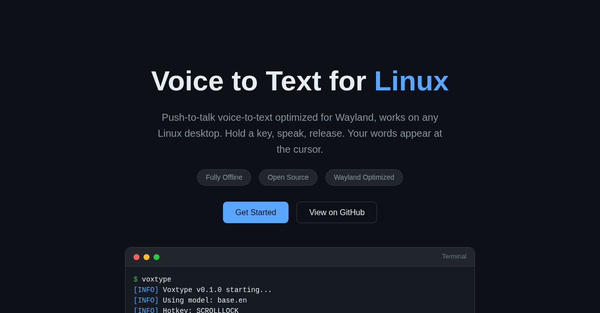

# Voxtype

[](https://voxtype.io)

**[voxtype.io](https://voxtype.io)**

Push-to-talk voice-to-text for Linux. Optimized for Wayland, works on X11 too.

Hold a hotkey (default: ScrollLock) while speaking, release to transcribe and output the text at your cursor position.

## Features

- **Works on any Linux desktop** - Uses kernel-level input (evdev). Works on Wayland and X11
- **Fully offline** - Uses whisper.cpp for local transcription, no internet required
- **Fallback chain** - Types via wtype (best CJK support), falls back to ydotool, then clipboard
- **Push-to-talk or Toggle mode** - Hold to record, or press once to start/stop
- **Audio feedback** - Optional sound cues when recording starts/stops
- **Configurable** - Choose your hotkey, model size, output mode, and more
- **Waybar integration** - Optional status indicator shows recording state in your bar

## Quick Start

```bash
# 1. Build
cargo build --release

# 2. Install typing backend (Wayland)
# Fedora:
sudo dnf install wtype
# Arch:
sudo pacman -S wtype
# Ubuntu:
sudo apt install wtype

# 3. Download whisper model
./target/release/voxtype setup --download

# 4. Add keybinding to your compositor
# See "Compositor Keybindings" section below

# 5. Run
./target/release/voxtype
```

### Compositor Keybindings

Voxtype works best with your compositor's native keybindings. Add these to your compositor config:

**Hyprland** (`~/.config/hypr/hyprland.conf`):
```
bind = SUPER, V, exec, voxtype record start
bindr = SUPER, V, exec, voxtype record stop
```

**Sway** (`~/.config/sway/config`):
```
bindsym --no-repeat $mod+v exec voxtype record start
bindsym --release $mod+v exec voxtype record stop
```

**River** (`~/.config/river/init`):
```bash
riverctl map normal Super V spawn 'voxtype record start'
riverctl map -release normal Super V spawn 'voxtype record stop'
```

Then disable the built-in hotkey in your config:
```toml
# ~/.config/voxtype/config.toml
[hotkey]
enabled = false
```

> **X11 / Built-in hotkey fallback:** If you're on X11 or prefer voxtype's built-in hotkey (ScrollLock by default), add yourself to the `input` group: `sudo usermod -aG input $USER` and log out/in. See the [User Manual](docs/USER_MANUAL.md) for details.

## Usage

1. Run `voxtype` (it runs as a foreground daemon)
2. Hold **ScrollLock** (or your configured hotkey)
3. Speak
4. Release the key
5. Text appears at your cursor (or in clipboard if typing isn't available)

Press Ctrl+C to stop the daemon.

### Toggle Mode

If you prefer to press once to start recording and again to stop (instead of holding):

```bash
# Via command line
voxtype --toggle

# Or in config.toml
[hotkey]
key = "SCROLLLOCK"
mode = "toggle"
```

## Configuration

Config file location: `~/.config/voxtype/config.toml`

```toml
[hotkey]
key = "SCROLLLOCK"  # Or: PAUSE, F13-F24, RIGHTALT, etc.
modifiers = []      # Optional: ["LEFTCTRL", "LEFTALT"]
# mode = "toggle"   # Uncomment for toggle mode (press to start/stop)

[audio]
device = "default"  # Or specific device from `pactl list sources short`
sample_rate = 16000
max_duration_secs = 60

# Audio feedback (sound cues when recording starts/stops)
# [audio.feedback]
# enabled = true
# theme = "default"   # "default", "subtle", "mechanical", or path to custom dir
# volume = 0.7        # 0.0 to 1.0

[whisper]
model = "base.en"   # tiny, base, small, medium, large-v3, large-v3-turbo
language = "en"     # Or "auto" for detection, or language code (es, fr, de, etc.)
translate = false   # Translate non-English speech to English
# threads = 4       # CPU threads for inference (omit for auto-detect)
# on_demand_loading = true  # Load model only when recording (saves memory)

[output]
mode = "type"       # "type", "clipboard", or "paste"
fallback_to_clipboard = true
type_delay_ms = 0   # Increase if characters are dropped
# Note: "paste" mode copies to clipboard then simulates Ctrl+V
#       Useful for non-US keyboard layouts where ydotool typing fails

[output.notification]
on_recording_start = false  # Notify when PTT activates
on_recording_stop = false   # Notify when transcribing
on_transcription = true     # Show transcribed text

# Text processing (word replacements, spoken punctuation)
# [text]
# spoken_punctuation = true  # Say "period" → ".", "open paren" → "("
# replacements = { "vox type" = "voxtype", "oh marky" = "Omarchy" }

# State file for Waybar/polybar integration (enabled by default)
state_file = "auto"  # Or custom path, or "disabled" to turn off
```

### Audio Feedback

Enable audio feedback to hear a sound when recording starts and stops:

```toml
[audio.feedback]
enabled = true
theme = "default"  # Built-in themes: default, subtle, mechanical
volume = 0.7       # 0.0 to 1.0
```

**Built-in themes:**
- `default` - Clear, pleasant two-tone beeps
- `subtle` - Quiet, unobtrusive clicks
- `mechanical` - Typewriter/keyboard-like sounds

**Custom themes:** Point `theme` to a directory containing `start.wav`, `stop.wav`, and `error.wav` files.

### Text Processing

Voxtype can post-process transcribed text with word replacements and spoken punctuation.

**Word replacements** fix commonly misheard words:

```toml
[text]
replacements = { "vox type" = "voxtype", "oh marky" = "Omarchy" }
```

**Spoken punctuation** (opt-in) converts spoken words to symbols - useful for developers:

```toml
[text]
spoken_punctuation = true
```

With this enabled, saying "function open paren close paren" outputs `function()`. Supports period, comma, brackets, braces, newlines, and many more. See [CONFIGURATION.md](docs/CONFIGURATION.md#text) for the full list.

### Post-Processing Command (Advanced)

For advanced cleanup, you can pipe transcriptions through an external command
like a local LLM for grammar correction, filler word removal, or text formatting:

```toml
[output.post_process]
command = "ollama run llama3.2:1b 'Clean up this dictation. Fix grammar, remove filler words:'"
timeout_ms = 30000  # 30 second timeout for LLM
```

The command receives text on stdin and outputs cleaned text on stdout. On any
failure (timeout, error), Voxtype gracefully falls back to the original transcription.

See [CONFIGURATION.md](docs/CONFIGURATION.md#outputpost_process) for more examples including scripts for LM Studio, Ollama, and llama.cpp.

## CLI Options

```
voxtype [OPTIONS] [COMMAND]

Commands:
  daemon      Run as background daemon (default)
  transcribe  Transcribe an audio file
  setup       Setup and installation utilities
  config      Show current configuration
  status      Show daemon status (for Waybar/polybar integration)
  record      Control recording from external sources (compositor keybindings, scripts)

Setup subcommands:
  voxtype setup              Run basic dependency checks (default)
  voxtype setup --download   Download the configured Whisper model
  voxtype setup systemd      Install/manage systemd user service
  voxtype setup waybar       Generate Waybar module configuration
  voxtype setup model        Interactive model selection and download
  voxtype setup gpu          Manage GPU acceleration (switch CPU/Vulkan)

Status options:
  voxtype status --format json       Output as JSON (for Waybar)
  voxtype status --follow            Continuously output on state changes
  voxtype status --extended          Include model, device, backend in JSON
  voxtype status --icon-theme THEME  Icon theme (emoji, nerd-font, material, etc.)

Record subcommands (for compositor keybindings):
  voxtype record start   Start recording (send SIGUSR1 to daemon)
  voxtype record stop    Stop recording and transcribe (send SIGUSR2 to daemon)
  voxtype record toggle  Toggle recording state

Options:
  -c, --config <FILE>  Path to config file
  -v, --verbose        Increase verbosity (-v, -vv)
  -q, --quiet          Quiet mode (errors only)
  --clipboard          Force clipboard mode
  --paste              Force paste mode (clipboard + Ctrl+V)
  --model <MODEL>      Override whisper model
  --hotkey <KEY>       Override hotkey
  --toggle             Use toggle mode (press to start/stop)
  -h, --help           Print help
  -V, --version        Print version
```

## Whisper Models

| Model | Size | English WER | Speed |
|-------|------|-------------|-------|
| tiny.en | 39 MB | ~10% | Fastest |
| base.en | 142 MB | ~8% | Fast |
| small.en | 466 MB | ~6% | Medium |
| medium.en | 1.5 GB | ~5% | Slow |
| large-v3 | 3 GB | ~4% | Slowest |
| large-v3-turbo | 1.6 GB | ~4% | Fast |

For most uses, `base.en` provides a good balance of speed and accuracy. If you have a GPU, `large-v3-turbo` offers excellent accuracy with fast inference.

### Multilingual Support

The `.en` models are English-only but faster and more accurate for English. For other languages, use `large-v3` which supports 99 languages.

**Use Case 1: Transcribe in the spoken language** (speak French, output French)
```toml
[whisper]
model = "large-v3"
language = "auto"     # Auto-detect and transcribe in that language
translate = false
```

**Use Case 2: Translate to English** (speak French, output English)
```toml
[whisper]
model = "large-v3"
language = "auto"     # Auto-detect the spoken language
translate = true      # Translate output to English
```

**Use Case 3: Force a specific language** (always transcribe as Spanish)
```toml
[whisper]
model = "large-v3"
language = "es"       # Force Spanish transcription
translate = false
```

With GPU acceleration, `large-v3` achieves sub-second inference while supporting all languages.

## GPU Acceleration

Voxtype supports optional GPU acceleration for significantly faster inference. With GPU acceleration, even the `large-v3` model can achieve sub-second inference times.

### Vulkan (AMD, NVIDIA, Intel)

Packages include a Vulkan binary. To enable GPU acceleration:

```bash
# Install Vulkan runtime (if not already installed)
# Arch:
sudo pacman -S vulkan-icd-loader

# Ubuntu/Debian:
sudo apt install libvulkan1

# Fedora:
sudo dnf install vulkan-loader

# Enable GPU acceleration
sudo voxtype setup gpu --enable

# Check status
voxtype setup gpu
```

To switch back to CPU: `sudo voxtype setup gpu --disable`

### Building from Source (CUDA, Metal, ROCm)

For other GPU backends, build from source with the appropriate feature flag:

**CUDA (NVIDIA)**
```bash
# Install CUDA toolkit first, then:
cargo build --release --features gpu-cuda
```

**Metal (macOS/Apple Silicon)**
```bash
cargo build --release --features gpu-metal
```

**HIP/ROCm (AMD alternative)**
```bash
cargo build --release --features gpu-hipblas
```

### Performance Comparison

Results vary by hardware. Example on AMD RX 6800:

| Model | CPU | Vulkan GPU |
|-------|-----|------------|
| base.en | ~7x realtime | ~35x realtime |
| large-v3 | ~1x realtime | ~5x realtime |

## Requirements

### System Requirements

- **Linux** with glibc 2.38+ (Ubuntu 24.04+, Fedora 39+, Arch, Debian Trixie+)
- **Wayland or X11** desktop (GNOME, KDE, Sway, Hyprland, River, i3, etc.)

### Runtime Dependencies

- **PipeWire** or **PulseAudio** (for audio capture)
- **wtype** (for typing output on Wayland) - *recommended, best CJK/Unicode support*
- **ydotool** + daemon - *for X11 or as Wayland fallback*
- **wl-clipboard** (for clipboard fallback on Wayland)

### Permissions

- **Wayland compositors:** No special permissions needed when using compositor keybindings
- **Built-in hotkey / X11:** User must be in the `input` group (for evdev access)

### Installing Dependencies

**Fedora:**
```bash
sudo dnf install wtype wl-clipboard
```

**Ubuntu/Debian:**
```bash
sudo apt install wtype wl-clipboard
```

**Arch:**
```bash
sudo pacman -S wtype wl-clipboard
```

## Building from Source

```bash
# Install Rust if needed
curl --proto '=https' --tlsv1.2 -sSf https://sh.rustup.rs | sh

# Install build dependencies
# Fedora:
sudo dnf install alsa-lib-devel

# Ubuntu:
sudo apt install libasound2-dev

# Build
cargo build --release

# Binary is at: target/release/voxtype
```

## Waybar Integration

Add to your Waybar config:

```json
"custom/voxtype": {
    "exec": "voxtype status --follow --format json",
    "return-type": "json",
    "format": "{}",
    "tooltip": true
}
```

The state file is enabled by default (`state_file = "auto"`). If you've disabled it, re-enable it:

```toml
state_file = "auto"
```

### Extended Status Info

Use `--extended` to include model, device, and backend in the JSON output:

```bash
voxtype status --format json --extended
```

Output:
```json
{
  "text": "🎙️",
  "class": "idle",
  "tooltip": "Voxtype ready\nModel: base.en\nDevice: default\nBackend: CPU (AVX-512)",
  "model": "base.en",
  "device": "default",
  "backend": "CPU (AVX-512)"
}
```

Waybar config with model display:
```json
"custom/voxtype": {
    "exec": "voxtype status --follow --format json --extended",
    "return-type": "json",
    "format": "{} [{}]",
    "format-alt": "{model}",
    "tooltip": true
}
```

## Troubleshooting

### "Cannot open input device" error

This only affects the built-in evdev hotkey. You have two options:

**Option 1: Use compositor keybindings (recommended)**
Configure your compositor to call `voxtype record start/stop` and disable the built-in hotkey. See "Compositor Keybindings" above.

**Option 2: Add yourself to the input group**
```bash
sudo usermod -aG input $USER
# Log out and back in
```

### Text not appearing / typing not working

Voxtype uses wtype (preferred) or ydotool as fallback for typing output:

```bash
# Check if wtype is installed
which wtype

# If using ydotool fallback (X11/TTY), start the daemon:
systemctl --user start ydotool
systemctl --user enable ydotool  # Start on login
```

### No audio captured

Check your default audio input:

```bash
# List audio sources
pactl list sources short

# Test recording
arecord -d 3 -f S16_LE -r 16000 test.wav
aplay test.wav
```

### Text appears slowly

If characters are being dropped, increase the delay:

```toml
[output]
type_delay_ms = 10
```

## Architecture

```
┌───────────────────────────────────────────────────────────────────────┐
│                              Daemon                                   │
├───────────────────────────────────────────────────────────────────────┤
│  ┌──────────────┐  ┌──────────────┐  ┌──────────────┐  ┌───────────┐ │
│  │   Hotkey     │  │    Audio     │  │ Post-Process │  │   Output  │ │
│  │  (evdev)     │──│   (cpal)     │──│  (optional)  │──│  (wtype)  │ │
│  └──────────────┘  └──────────────┘  └──────────────┘  └───────────┘ │
│         │               │                   │                │        │
│         │               ▼                   │                │        │
│         │        ┌──────────────┐           │                │        │
│         │        │   Whisper    │───────────┘                │        │
│         └───────▶│  (whisper-rs)│────────────────────────────┘        │
│                  └──────────────┘                                     │
└───────────────────────────────────────────────────────────────────────┘
```

**Why compositor keybindings?** Wayland compositors like Hyprland, Sway, and River support key-release events, enabling push-to-talk without special permissions. Voxtype's `record start/stop` commands integrate directly with your compositor's keybinding system.

**Fallback: evdev hotkey.** For X11 or compositors without key-release support, voxtype includes a built-in hotkey using evdev (the Linux input subsystem). This requires the user to be in the `input` group.

**Why wtype + ydotool?** On Wayland, wtype uses the virtual-keyboard protocol for text input, with excellent Unicode/CJK support and no daemon required. On X11 (or as a fallback), ydotool uses uinput for text injection. This combination ensures Voxtype works on any Linux desktop.

**Post-processing.** Transcriptions can optionally be piped through an external command before output. Use this to integrate local LLMs (Ollama, llama.cpp) for grammar correction, text expansion, or domain-specific vocabulary. Any command that reads stdin and writes stdout works.

## Feedback

We want to hear from you! Voxtype is a young project and your feedback helps make it better.

- **Something not working?** If Voxtype doesn't install cleanly, doesn't work on your system, or is buggy in any way, please [open an issue](https://github.com/peteonrails/voxtype/issues). I actively monitor and respond to issues.
- **Like Voxtype?** I don't accept donations, but if you find it useful:
  - A [GitHub star](https://github.com/peteonrails/voxtype) helps others discover the project
  - Arch users: a vote on the [AUR package](https://aur.archlinux.org/packages/voxtype) helps keep it maintained

## Contributors

- [Peter Jackson](https://github.com/peteonrails) - Creator and maintainer
- [jvantillo](https://github.com/jvantillo) - GPU acceleration patch, whisper-rs 0.15.1 compatibility
- [materemias](https://github.com/materemias) - Paste output mode, on-demand model loading, PKGBUILD fix
- [reisset](https://github.com/reisset) - Testing and feedback on post-processing feature
- [Goodroot](https://github.com/goodroot) - Testing, feedback, and documentation updates

## License

MIT
