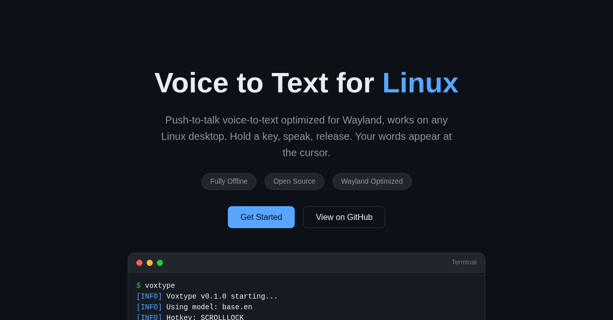
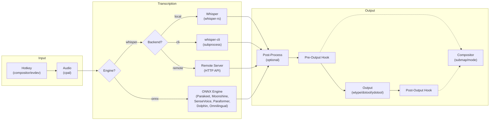

# Voxtype

[](https://voxtype.io)

**[voxtype.io](https://voxtype.io)**

Linux 上的语音转文字工具。在你的 CPU 上就有 9–11 倍实时的速度。默认完全本地运行。

按住热键(默认 ScrollLock)说话,松开后转写,并把文字输出到光标位置。在普通的 Zen 4 CPU 上,Voxtype 跑 Cohere Transcribe(Open ASR Leaderboard 榜首)比实时还快。需要的话还有 Parakeet、Whisper 等共九种引擎。无云端、无订阅、无遥测。

> 本文件是 [README.md](README.md) 的简体中文版。英文原版是最新、最权威的版本;两者如有出入,以英文原版为准。

## 功能特性

### 速度与引擎

- **Cohere Transcribe 在 CPU 上达到 9–11 倍实时。** 量化后仅 1.5 GB(q4f16)。开箱即带标点、大小写和文本规范化。Open ASR Leaderboard 榜首。*(0.7.0 新增)*
- **Parakeet 支持 AMD 与 NVIDIA GPU。** Radeon 用 MIGraphX 7.2,每个 NVIDIA 驱动世代都有独立的 CUDA 12 / CUDA 13 二进制,Whisper 则跨厂商走 Vulkan。*(MIGraphX 为 0.7.0 新增)*
- **OpenVINO Whisper 支持 Intel NPU、CPU 或 GPU。** 通过 OpenVINO IR 运行 Whisper 模型,Lunar Lake 机器上可用 Intel NPU 加速,其他 Intel 平台回退到 CPU/GPU。
- **内置文本处理。** 口述标点(`"comma"` → `,`)、针对常见误转写的个人替换表,以及可选的 LLM 或 shell 脚本后处理管道。修正领域术语、去掉口头语、润色语法 —— 全都不用离开 voxtype。
- **按引擎动态加载模型。** 可以配置全部 9 种引擎,但只为当前使用的那一个付出内存。模型首次使用时加载,空闲时卸载。
- **九种转写引擎。** Whisper、Parakeet、Moonshine、SenseVoice、Paraformer、Dolphin、Omnilingual、Cohere、OpenVINO Whisper。用 `voxtype configure` 或改一行配置即可切换。多语言引擎覆盖 CJK 及 1600 多种语言。
- **会议模式。** 连续转写,自动分块,说话人归属,并可导出为 Markdown、JSON、SRT 或 VTT。

### 原生 Linux 集成

- **Hyprland、Niri、Sway、River、GNOME、KDE。** 各合成器都支持快捷键绑定,X11 下有 evdev 回退,Wayland 优先用 wtype 输入且完整支持 CJK。任一层不可用时依次回退 dotool → ydotool → 剪贴板。
- **自动暂停你的音乐。** 开始口述的瞬间自动暂停 Spotify、Plasma 媒体播放器以及任何支持 MPRIS 的播放器,松开时恢复。
- **浮动的波形 OSD。** 默认与你的 swayosd 指示条对齐 —— 与音量、亮度处于同一垂直位置,让音量条出现在你已经习惯看的地方。
- **交互式 TUI 配置。** `voxtype configure`(也会出现在 Walker / fuzzel / rofi 里)帮你编辑 `~/.config/voxtype/config.toml` 中的每一项 —— 不用手写 TOML。会自动下载缺失的模型、通过 pkexec 切换 GPU 二进制、在需要时重启守护进程。
- **按住说话或切换模式。** 按住录音,或者按一次开始/再按一次停止。可选在开始/停止录音时播放提示音。

### 可信

- **默认本地。无云端。无订阅。无遥测。** 需要时可选用远程 Whisper 服务。在你主动选择之前,音频始终留在你自己的机器上。
- **MIT 许可。** AUR(`voxtype`、`voxtype-bin`,以及给想尝鲜预发布版本的用户准备的 `voxtype-bin-rc` —— 见 [docs/INSTALL.md](docs/INSTALL.md#arch-linux))、`.deb`、`.rpm`、macOS 上的 Homebrew。发布二进制由可复现的 Docker 流水线签名构建。

## 快速开始

大多数用户应该安装[预编译包](docs/INSTALL.md)。以下步骤适用于从源码构建。

```bash
# 1. 安装构建依赖
# Fedora:
sudo dnf install rust cargo alsa-lib-devel clang-devel cmake pkgconf
# Arch:
sudo pacman -S rustup alsa-lib clang cmake pkgconf
# Debian/Ubuntu:
sudo apt install cargo libasound2-dev libclang-dev cmake pkg-config

# 2. 构建
cargo build --release

# 3. 安装输入后端(Wayland)
# Fedora:
sudo dnf install wtype
# Arch:
sudo pacman -S wtype
# Ubuntu:
sudo apt install wtype

# 4. 下载 whisper 模型
./target/release/voxtype setup --download

# 5. 为你的合成器添加快捷键
# 见下文“合成器快捷键”一节

# 6. 运行
./target/release/voxtype
```

完整的各发行版依赖清单(含 GPU 后端)见 [docs/INSTALL.md](docs/INSTALL.md#build-dependencies-source-builds-only)。

### 合成器快捷键

Voxtype 最适合搭配合成器自带的快捷键。把下列内容加入你的合成器配置。

> **不确定自己用的是哪个合成器?** 在终端里运行 `echo $XDG_CURRENT_DESKTOP`。常见取值:`Hyprland`、`sway`、`river`、`KDE`、`GNOME`。

**Hyprland**(`~/.config/hypr/hyprland.conf`):
```
bind = SUPER, V, exec, voxtype record start
bindr = SUPER, V, exec, voxtype record stop
```

**Sway**(`~/.config/sway/config`):
```
bindsym --no-repeat $mod+v exec voxtype record start
bindsym --release $mod+v exec voxtype record stop
```

**River**(`~/.config/river/init`):
```bash
riverctl map normal Super V spawn 'voxtype record start'
riverctl map -release normal Super V spawn 'voxtype record stop'
```

**KDE Plasma (KWin):**

KDE 不支持按键释放事件,所以要使用切换模式。打开 **系统设置 > 快捷键 > 自定义快捷键**,新建一个快捷键,把命令设为:
```
voxtype record toggle
```

分配你喜欢的组合键(例如 Meta+V)。由于快捷键由 KDE 处理,内置热键应当禁用(见下)。

然后在配置里禁用内置热键:
```toml
# ~/.config/voxtype/config.toml
[hotkey]
enabled = false
```

> **X11 / 内置热键回退:** 如果你在 X11 下,或更喜欢 voxtype 的内置热键(默认 ScrollLock),请把自己加入 `input` 组:`sudo usermod -aG input $USER`,然后重新登录。详见[用户手册](docs/USER_MANUAL.md)。

> **Omarchy / 多修饰键快捷键:** 如果使用带多个修饰键的快捷键(例如 `SUPER+CTRL+X`),松键较慢时打出的文字可能会触发窗口管理器快捷键而不是插入文本。解决方案(使用输出钩子和 Hyprland submap)见故障排查指南中的[修饰键干扰](docs/TROUBLESHOOTING.md#modifier-key-interference-hyprlandsway)。

## 使用

1. 运行 `voxtype`(它以前台守护进程方式运行)
2. 按住 **ScrollLock**(或你配置的热键)
3. 说话
4. 松开按键
5. 文字出现在光标处(如果无法输入,则进入剪贴板)

按 Ctrl+C 停止守护进程。

### 切换模式

如果你更想“按一次开始录音、再按一次停止”(而不是按住):

```bash
# 通过命令行
voxtype --toggle

# 或在 config.toml 里
[hotkey]
key = "SCROLLLOCK"
mode = "toggle"
```

### 会议模式

对于会议、访谈这类较长的录音,会议模式提供连续转写、自动分块、说话人归属和导出。

```bash
# 开始一场会议
voxtype meeting start --title "Weekly standup"

# 查看状态
voxtype meeting status

# 停止并导出
voxtype meeting stop
voxtype meeting export latest --format markdown --speakers --timestamps
```

会议记录保存在本地,可导出为 Markdown、纯文本、JSON、SRT 或 VTT。用 `voxtype meeting list` 查看历史会议,用 `voxtype meeting summarize latest` 通过 Ollama 生成 AI 摘要。

## 配置

配置文件位置:`~/.config/voxtype/config.toml`

带完整注释的默认配置见 [`config/default.toml`](config/default.toml)。

```toml
# 供 Waybar/polybar 集成使用的状态文件(默认启用)
state_file = "auto"  # 也可填自定义路径,或 "disabled" 关闭

[hotkey]
key = "SCROLLLOCK"  # 也可用:PAUSE、F13-F24、RIGHTALT 等
modifiers = []      # 可选:["LEFTCTRL", "LEFTALT"]
# mode = "toggle"   # 取消注释即切换模式(按一次开始/停止)

[audio]
device = "default"  # 或 `pactl list sources short` 中的具体设备
sample_rate = 16000
max_duration_secs = 60

# 音频反馈(录音开始/停止时的提示音)
# [audio.feedback]
# enabled = true
# theme = "default"   # "default"、"subtle"、"mechanical",或自定义目录路径
# volume = 0.7        # 0.0 到 1.0

[whisper]
model = "base.en"   # tiny、base、small、medium、large-v3、large-v3-turbo
language = "en"     # 或 "auto" 自动检测,或语言代码(es、fr、de 等)
translate = false   # 把非英语语音翻译成英语
# threads = 4       # 推理用的 CPU 线程数(省略则自动检测)
# on_demand_loading = true  # 仅在录音时加载模型(节省内存)

[output]
mode = "type"       # "type"、"clipboard" 或 "paste"
fallback_to_clipboard = true
type_delay_ms = 0   # 如果丢字符就调大
# auto_submit = true  # 转写后发送回车(适用于聊天软件、终端)
# 注意:"paste" 模式会先复制到剪贴板再模拟 Ctrl+V
#       适用于 ydotool 输入失败的非美式键盘布局
# 需要通过直接 dotool 回退来使用带变体的多语言布局时:
# [output.language_to_variant]
# ru = "phonetic"
# dotoolc 不支持变体,也收不到这些提示。使用 dotool 时,
# 请在口述前把桌面布局切到俄语 phonetic。

[output.notification]
on_recording_start = false  # 按住说话激活时通知
on_recording_stop = false   # 开始转写时通知
on_transcription = true     # 显示转写文本

# 文本处理(词语替换、口述标点)
# [text]
# spoken_punctuation = true  # 说 "period" → ".","open paren" → "("
# replacements = { "vox type" = "voxtype", "oh marky" = "Omarchy" }
```

### 中文用户推荐配置

中文语音输入建议使用 **SenseVoice** 引擎(针对中/日/韩/粤优化,小模型、速度快),并把热键设为按住说话:

```toml
engine = "sensevoice"

[hotkey]
key = "RIGHTALT"       # 按住右 Alt 说话,松开转写
mode = "push_to_talk"

[sensevoice]
model = "sensevoice-small"
language = "zh"
use_itn = true
on_demand_loading = true   # 不用时模型卸载,空闲内存仅约 14 MB
```

需要注意:`[hotkey]` 的 `enabled` 默认即为 `true`,无需显式书写。另外,**从源码构建时请勿在 conda 环境激活、且 `gcc` 指向 conda 版本的情况下编译** —— conda 的编译器会往二进制里写入指向 miniconda 的 `RPATH`,导致加载到缺少插件的 `libasound`,录音会失败。详见[故障排查](docs/TROUBLESHOOTING.md#failed-to-start-audio-on-a-binary-built-with-a-conda-toolchain)。

### 音频反馈

启用音频反馈后,录音开始和停止时会听到提示音:

```toml
[audio.feedback]
enabled = true
theme = "default"  # 内置主题:default、subtle、mechanical
volume = 0.7       # 0.0 到 1.0
```

**内置主题:**
- `default` —— 清晰悦耳的双音提示
- `subtle` —— 安静、不打扰的咔哒声
- `mechanical` —— 类似打字机/键盘的声音

**自定义主题:** 把 `theme` 指向一个包含 `start.wav`、`stop.wav` 和 `error.wav` 的目录。

### 文本处理

Voxtype 可以通过词语替换和口述标点对转写文本做后处理。

**词语替换**用于修正常见听错的词:

```toml
[text]
replacements = { "vox type" = "voxtype", "oh marky" = "Omarchy" }
```

**口述标点**(需手动开启)把说出的词转成符号,对开发者很实用:

```toml
[text]
spoken_punctuation = true
```

开启后,说 "function open paren close paren" 会输出 `function()`。支持句号、逗号、方括号、花括号、换行等。完整列表见 [CONFIGURATION.md](docs/CONFIGURATION.md#text)。

### 后处理命令(高级)

需要更高级的清理时,可以把转写文本通过管道送给外部命令,例如本地 LLM,用于语法修正、去掉口头语或格式化文本:

```toml
[output.post_process]
command = "ollama run llama3.2:1b 'Clean up this dictation. Fix grammar, remove filler words:'"
timeout_ms = 30000  # LLM 的 30 秒超时
```

该命令从 stdin 读取文本,把处理后的文本写到 stdout。任何失败(超时、报错)都会优雅地回退到原始转写结果。

更多示例(包括 LM Studio、Ollama 和 llama.cpp 的脚本)见 [CONFIGURATION.md](docs/CONFIGURATION.md#outputpost_process)。

## 命令行选项

```
voxtype [OPTIONS] [COMMAND]

Commands:
  daemon      以守护进程方式运行(默认)
  transcribe  转写一个音频文件
  setup       安装与配置工具
  config      显示当前配置
  status      显示守护进程状态(供 Waybar/polybar 集成)
  record      从外部控制录音(合成器快捷键、脚本)
  meeting     会议转写(start、stop、export、summarize)

Setup 子命令:
  voxtype setup              运行基础依赖检查(默认)
  voxtype setup --download   下载已配置的 Whisper 模型
  voxtype setup systemd      安装/管理 systemd 用户服务
  voxtype setup waybar       生成 Waybar 模块配置
  voxtype setup model        交互式选择并下载模型
  voxtype setup gpu          管理 GPU 加速(切换 CPU/Vulkan)
  voxtype setup onnx         在 Whisper 与 ONNX 引擎之间切换

Status 选项:
  voxtype status --format json       以 JSON 输出(供 Waybar)
  voxtype status --follow            状态变化时持续输出
  voxtype status --extended          JSON 中附带模型、设备、后端信息
  voxtype status --icon-theme THEME  图标主题(emoji、nerd-font、material 等)

Record 子命令(供合成器快捷键使用):
  voxtype record start                     开始录音(向守护进程发送 SIGUSR1)
  voxtype record start --output-file PATH  把转写写入文件
  voxtype record stop                      停止录音并转写(发送 SIGUSR2)
  voxtype record toggle                    切换录音状态

Options:
  -c, --config <FILE>    配置文件路径
  -v, --verbose          提高日志详细度(-v、-vv)
  -q, --quiet            安静模式(仅错误)
  --clipboard            强制剪贴板模式
  --paste                强制 paste 模式(剪贴板 + Ctrl+V)
  --model <MODEL>        覆盖转写模型
  --engine <ENGINE>      覆盖转写引擎(whisper、parakeet、moonshine、sensevoice、paraformer、dolphin、omnilingual)
  --hotkey <KEY>         覆盖热键
  --toggle               使用切换模式(按一次开始/停止)
  -h, --help             打印帮助
  -V, --version          打印版本
```

## Whisper 模型

| 模型 | 大小 | 英语 WER | 速度 |
|-------|------|-------------|-------|
| tiny.en | 39 MB | ~10% | 最快 |
| base.en | 142 MB | ~8% | 快 |
| small.en | 466 MB | ~6% | 中等 |
| medium.en | 1.5 GB | ~5% | 慢 |
| large-v3 | 3 GB | ~4% | 最慢 |
| large-v3-turbo | 1.6 GB | ~4% | 快 |

大多数场景下 `base.en` 在速度与准确率之间取得了不错的平衡。如果你有 GPU,`large-v3-turbo` 能以很快的推理速度提供出色的准确率。

### 多语言支持

`.en` 系列模型只支持英语,但对英语更快、更准。其他语言请使用支持 99 种语言的 `large-v3`。

**用法一:用所说语言转写**(说法语,输出法语)
```toml
[whisper]
model = "large-v3"
language = "auto"     # 自动检测并以该语言转写
translate = false
```

**用法二:翻译成英语**(说法语,输出英语)
```toml
[whisper]
model = "large-v3"
language = "auto"     # 自动检测所说语言
translate = true      # 把输出翻译成英语
```

**用法三:强制指定语言**(始终按西班牙语转写)
```toml
[whisper]
model = "large-v3"
language = "es"       # 强制西班牙语转写
translate = false
```

在 GPU 加速下,`large-v3` 可以在支持所有语言的同时做到亚秒级推理。

## 支持的引擎

Voxtype 为 Whisper 与 ONNX 引擎提供各自的二进制。用 `voxtype setup onnx --enable` 切到 ONNX 二进制,`--disable` 切回。

| 引擎 | 语言 | 架构 | 适用场景 |
|--------|-----------|-------------|----------|
| **Whisper**(默认) | 99 种语言 | Encoder-decoder(whisper.cpp) | 通用、多语言 |
| **Parakeet** | 英语 | FastConformer TDT(ONNX) | 快速英语转写 |
| **Moonshine** | 英语 | Encoder-decoder(ONNX) | 边缘设备、低内存 |
| **SenseVoice** | zh、en、ja、ko、yue | CTC encoder(ONNX) | 中文、日文、韩文 |
| **Paraformer** | zh+en、zh+yue+en | 非自回归(ONNX) | 中英双语 |
| **Dolphin** | 40 种语言 + 22 种中文方言 | CTC E-Branchformer(ONNX) | 东方语言(不含英语) |
| **Omnilingual** | 1600+ 种语言 | wav2vec2 CTC(ONNX) | 低资源与稀有语言 |
| **Cohere Transcribe** | 14 种语言 | Encoder-decoder(ONNX) | 带标点的快速 CPU 口述 |
| **OpenVINO Whisper** | 99 种语言 | Encoder-decoder(OpenVINO) | Intel NPU(Lunar Lake),CPU/GPU 回退 |

在配置中设置引擎:

```toml
engine = "sensevoice"  # 或:whisper、parakeet、moonshine、paraformer、dolphin、omnilingual、cohere、openvino
```

或在命令行覆盖:

```bash
voxtype --engine sensevoice
```

## GPU 加速

Voxtype 支持可选的 GPU 加速,能显著加快推理。开启后,即使是 `large-v3` 也能做到亚秒级推理。

### Vulkan(AMD、NVIDIA、Intel)

发行包中已包含 Vulkan 二进制。启用 GPU 加速:

```bash
# 安装 Vulkan 运行时(如尚未安装)
# Arch:
sudo pacman -S vulkan-icd-loader

# Ubuntu/Debian:
sudo apt install libvulkan1

# Fedora:
sudo dnf install vulkan-loader

# 启用 GPU 加速
sudo voxtype setup gpu --enable

# 查看状态
voxtype setup gpu
```

切回 CPU:`sudo voxtype setup gpu --disable`

### 从源码构建(CUDA、Metal、ROCm)

其他 GPU 后端需要用相应的 feature 标志从源码构建:

**CUDA(NVIDIA)**
```bash
# 先安装 CUDA toolkit,然后:
cargo build --release --features gpu-cuda
```

**Metal(macOS/Apple Silicon)**
```bash
cargo build --release --features gpu-metal
```

**HIP/ROCm(AMD 的另一种方案)**
```bash
cargo build --release --features gpu-hipblas
```

### Intel NPU(Lunar Lake、Arrow Lake、Meteor Lake)

Intel NPU 加速使用 OpenVINO GenAI,配合导出为 OpenVINO IR 格式的 Whisper 模型:

```bash
# 构建时启用 OpenVINO 支持
cargo build --release --features openvino-whisper

# Arch Linux:安装核心运行时,以及你设备对应的插件/驱动
sudo pacman -S openvino openvino-intel-npu-plugin intel-npu-driver        # NPU
# sudo pacman -S openvino openvino-intel-gpu-plugin level-zero-loader intel-compute-runtime  # GPU
# sudo pacman -S openvino                                                  # CPU

# 下载模型
voxtype setup model  # 选择一个 OpenVINO 模型

# 配置
cat >> ~/.config/voxtype/config.toml << 'EOF'
engine = "openvino"

[openvino]
model = "base.en-int8"
device = "NPU"
EOF
```

每个设备还需要来自 Intel [版本匹配的 OpenVINO GenAI C/C++ SDK 归档](https://storage.openvinotoolkit.org/repositories/openvino_genai/packages/)的
`libopenvino_genai_c.so`。`openvino-genai` pip wheel 和 `openvino-genai-bin` 包都不包含这个 C API 库。
请解压 SDK,并把 `openvino_dir` 指向其根目录(或把 `runtime/lib/intel64` 加入 `LD_LIBRARY_PATH`)。
启用 OpenVINO 的发布二进制只会在 `engine = "openvino"` 时加载该运行时,因此其他引擎不需要任何 OpenVINO 包。

NPU 驱动需要重启后才能生效;用 `ls /dev/accel/accel*` 验证。Intel GPU 则用 `ls /dev/dri/renderD*` 验证是否有渲染节点。
把 `device` 设为 `"CPU"` 可只用 CPU 推理,此时不需要任何设备专用驱动。

### 性能对比

结果因硬件而异。以下是 AMD RX 6800 上的示例:

| 模型 | CPU | Vulkan GPU |
|-------|-----|------------|
| base.en | ~7 倍实时 | ~35 倍实时 |
| large-v3 | ~1 倍实时 | ~5 倍实时 |

## 系统要求

### 系统要求

- **Linux**,glibc 2.38+(Ubuntu 24.04+、Fedora 39+、Arch、Debian Trixie+)
- **Wayland 或 X11** 桌面(GNOME、KDE、Sway、Hyprland、River、i3 等)

### 运行时依赖

- **PipeWire** 或 **PulseAudio**(用于采集音频)
- **wtype**(在 Wayland 上输出文字)—— *推荐,对 CJK/Unicode 支持最好*
- **dotool** —— *用于非美式键盘布局(德语、法语等),支持 XKB 布局*
- **ydotool** + 守护进程 —— *用于 X11,或作为 Wayland 的回退*
- **wl-clipboard**(用于 Wayland 上的剪贴板回退)

### 权限

- **Wayland 合成器:** 使用合成器快捷键时无需特殊权限
- **内置热键 / X11:** 用户需在 `input` 组中(以访问 evdev)

### 安装依赖

**Fedora:**
```bash
sudo dnf install wtype wl-clipboard
```

**Ubuntu/Debian:**
```bash
sudo apt install wtype wl-clipboard
```

**Arch:**
```bash
sudo pacman -S wtype wl-clipboard
```

## 从源码构建

```bash
# 如需安装 Rust
curl --proto '=https' --tlsv1.2 -sSf https://sh.rustup.rs | sh

# 安装构建依赖
# Fedora:
sudo dnf install alsa-lib-devel

# Ubuntu:
sudo apt install libasound2-dev

# 构建(仅 Whisper 引擎)
cargo build --release

# 构建并包含 ONNX 引擎(Parakeet、Moonshine、SenseVoice 等)
cargo build --release --features parakeet,moonshine,sensevoice,paraformer,dolphin

# 或只构建你需要的引擎
cargo build --release --features parakeet

# 二进制位于:target/release/voxtype
```

ONNX 引擎需要在构建时启用对应的 Cargo feature。否则在配置里设置
`engine = "parakeet"` 会报错。预编译发布二进制
(`-onnx-avx2`、`-onnx-cuda` 等)已包含全部 ONNX 引擎。

> **conda 用户注意:** 如果构建时 `PATH` 里的 `gcc`/`cc` 来自 conda,
> 链接器会写入指向 miniconda 的 `RPATH`,导致运行时加载 conda 的 `libasound`(缺少插件)而使录音失败。
> 请用系统工具链构建,详见[故障排查](docs/TROUBLESHOOTING.md#failed-to-start-audio-on-a-binary-built-with-a-conda-toolchain)。

## AppImage(通用)

AppImage 可在任何 Linux 发行版上免安装运行:

```bash
# 从 GitHub Release 下载对应的 AppImage
chmod +x voxtype-*-x86_64.AppImage

# 移动到一个固定位置
mv voxtype-*-x86_64.AppImage ~/.local/bin/voxtype

# 运行安装程序(下载模型、配置服务)
~/.local/bin/voxtype setup
```

可用的 AppImage 变体:
- `voxtype-{ver}-x86_64.AppImage` —— Whisper 引擎,支持 CPU 与 Vulkan GPU(推荐)
- `voxtype-{ver}-onnx-x86_64.AppImage` —— ONNX 引擎(Parakeet、Moonshine 等)+ Vulkan Whisper
- `voxtype-{ver}-onnx-cuda-x86_64.AppImage` —— ONNX 引擎 + NVIDIA CUDA + Vulkan Whisper

每个 ONNX AppImage 也包含 Vulkan Whisper 二进制,因此你可以在配置里通过
`engine = "whisper"` 或 `engine = "parakeet"` 切换引擎,而无需更换 AppImage。
若要在仅含 Whisper 的 AppImage 中使用 GPU 加速的 Whisper,请设置 `VOXTYPE_GPU=1`。

## Waybar 集成

在你的 Waybar 配置中加入:

```json
"custom/voxtype": {
    "exec": "voxtype status --follow --format json",
    "return-type": "json",
    "format": "{}",
    "tooltip": true
}
```

状态文件默认启用(`state_file = "auto"`)。如果你关闭过它,请重新启用:

```toml
state_file = "auto"
```

### 扩展状态信息

用 `--extended` 可在 JSON 输出中附带模型、设备和后端信息:

```bash
voxtype status --format json --extended
```

输出:
```json
{
  "text": "🎙️",
  "class": "idle",
  "tooltip": "Voxtype ready\nModel: base.en\nDevice: default\nBackend: CPU (AVX-512)",
  "model": "base.en",
  "device": "default",
  "backend": "CPU (AVX-512)"
}
```

带模型显示的 Waybar 配置:
```json
"custom/voxtype": {
    "exec": "voxtype status --follow --format json --extended",
    "return-type": "json",
    "format": "{} [{}]",
    "format-alt": "{model}",
    "tooltip": true
}
```

## 故障排查

### "Cannot open input device" 错误

这只影响内置的 evdev 热键。你有两个选择:

**方案一:使用合成器快捷键(推荐)**
配置你的合成器调用 `voxtype record start/stop`,并禁用内置热键。见上文“合成器快捷键”。

**方案二:把自己加入 input 组**
```bash
sudo usermod -aG input $USER
# 重新登录
```

### 文字没出现 / 输入不工作

Voxtype 使用 wtype(优先)、dotool 或 ydotool 来输出文字:

```bash
# 查看可用的输入后端
which wtype dotool ydotool

# 非美式键盘布局请安装 dotool 并配置:
# 在 ~/.config/voxtype/config.toml 中:
# [output]
# dotool_xkb_layout = "de"  # 你的布局(de、fr、es 等)
# dotool_xkb_variant = "nodeadkeys"  # 可选的固定变体;会使用直接 dotool
#
# 多语言口述时,优先通过直接 dotool 使用按语言的变体:
# [output.language_to_variant]
# ru = "phonetic"
# dotoolc 不支持变体,也收不到这些提示。请同时把桌面布局切到目标布局再口述。

# 如果使用 ydotool 回退(X11/TTY),启动其守护进程:
systemctl --user start ydotool
systemctl --user enable ydotool  # 登录时启动
```

**KDE Plasma / GNOME 用户:** wtype 在这两个桌面上不工作。Voxtype 会自动回退到 dotool(非美式布局推荐)或 ydotool。
配置说明见[故障排查](docs/TROUBLESHOOTING.md#wtype-not-working-on-kde-plasma-or-gnome-wayland)。

### 没有采集到音频

检查你的默认音频输入:

```bash
# 列出音频输入源
pactl list sources short

# 测试录音
arecord -d 3 -f S16_LE -r 16000 test.wav
aplay test.wav
```

如果这里正常但 Voxtype 报 `Failed to start audio`,请检查二进制是否被 conda 的
`RPATH` 污染,见[故障排查](docs/TROUBLESHOOTING.md#failed-to-start-audio-on-a-binary-built-with-a-conda-toolchain)。

### 文字出现得很慢

如果出现丢字符,请增大延迟:

```toml
[output]
type_delay_ms = 10
```

## 架构



**多种转写引擎。** Voxtype 在两种运行时后端之上支持 7 种转写引擎:
- **Whisper**(默认):通过 whisper.cpp 运行 OpenAI 的 Whisper 模型。支持本地进程内、CLI 子进程和远程 HTTP 后端。99 种语言。
- **ONNX 引擎**(通过 ONNX Runtime):Parakeet(英语)、Moonshine(英语)、SenseVoice(zh/en/ja/ko/yue)、Paraformer(中英双语)、Dolphin(40 种语言 + 中文方言,不含英语)、Omnilingual(1600+ 种语言)。用 `voxtype setup onnx` 切换引擎。

**为什么推荐合成器快捷键?** 像 Hyprland、Sway、River 这样的 Wayland 合成器支持按键释放事件,因此无需特殊权限即可实现按住说话。Voxtype 的 `record start/stop` 命令可以直接与合成器的快捷键系统集成。

**回退方案:evdev 热键。** 对于 X11 或不支持按键释放的合成器,voxtype 内置了基于 evdev(Linux 输入子系统)的热键。这要求用户在 `input` 组中。

**为什么是 wtype + dotool + ydotool?** 在 Wayland 上,wtype 通过虚拟键盘协议输入文字,对 Unicode/CJK 支持极佳且无需守护进程。当 wtype 失效(KDE/GNOME)时,直接 dotool 回退可通过 XKB 为非美式布局提供布局支持。作为最后的手段,ydotool 使用 uinput 在 X11/TTY 上注入文字。这一组合确保 Voxtype 能在任何 Linux 桌面上工作,并正确支持键盘布局。

**后处理。** 转写结果可选择在输出前通过外部命令处理。用它接入本地 LLM(Ollama、llama.cpp)来做语法修正、文本扩展或领域词表。任何从 stdin 读取、向 stdout 输出的命令都可以。

## 反馈

我们很想听到你的声音!Voxtype 是一个年轻的项目,你的反馈会让它变得更好。

- **有东西不工作?** 如果 Voxtype 安装不顺利、在你的系统上不工作,或有任何 bug,请[开一个 issue](https://github.com/peteonrails/voxtype/issues)。我会积极跟进并回复。
- **觉得 Voxtype 好用?** 我不接受捐赠,但如果它帮到了你:
  - 一个 [GitHub star](https://github.com/peteonrails/voxtype) 能帮助更多人发现这个项目
  - Arch 用户:给 [AUR 包](https://aur.archlinux.org/packages/voxtype)投一票有助于它持续维护

## 贡献者

- [Peter Jackson](https://github.com/peteonrails) - 创建者与维护者
- [jvantillo](https://github.com/jvantillo) - GPU 加速补丁、whisper-rs 0.15.1 兼容性
- [materemias](https://github.com/materemias) - paste 输出模式、按需加载模型、单实例保护、会议模式后处理、PKGBUILD 修复
- [Dan Heuckeroth](https://github.com/danheuck) - NixOS Home Manager 模块设计
- [Kevin Miller](https://github.com/digunix) - NixOS 模块增强、ROCm 支持
- [reisset](https://github.com/reisset) - 后处理功能的测试与反馈
- [Goodroot](https://github.com/goodroot) - 测试、反馈与文档更新
- [robzolkos](https://github.com/robzolkos) - 面向 AI agent 工作流的自动提交功能
- [konnsim](https://github.com/konnsim) - 修饰键干扰问题报告
- [IgorWarzocha](https://github.com/IgorWarzocha) - 修饰键修复的 Hyprland submap 方案
- [Zubair](https://github.com/mzubair481) - 支持键盘布局的 dotool 输出驱动
- [ayoahha](https://github.com/ayoahha) - whisper-cli 子进程转写的 CLI 后端
- [Loki Coyote](https://github.com/lokkju) - 面向 KDE/GNOME 的 eitype 输出驱动、媒体键与数字键码热键支持
- [Christopher Albert](https://github.com/krystophny) - macOS 移植基础、CoreAudio 采集、CGEvent 输出、Homebrew 打包
- [Umesh](https://github.com/radiorambo) - 文档网站
- [Sami Jawhar](https://github.com/sjawhar) - 预输入(eager input)处理接入
- [KaiStarkk](https://github.com/KaiStarkk) - 后处理 trim 与 fallback_on_empty 选项
- [graysky](https://github.com/graysky2) - flash attention 配置修复
- [OldJobobo](https://github.com/OldJobobo) - Quickshell OSD 主题、Omarchy 主题状态路径支持、可配置的媒体闪避、退化 Whisper 转写重试;共同维护 `quickshell/`
- [Matthias Breddin](https://github.com/lunetics) - IBus 非 ASCII 重排序排查、Rust 1.98 clippy 修复、媒体闪避淡入淡出、三次方闪避音量修正
- [Franklinyung](https://github.com/Franklinyung) - 简体中文 README、conda 链接的二进制导致音频启动失败的故障排查文档

## 许可证

MIT
